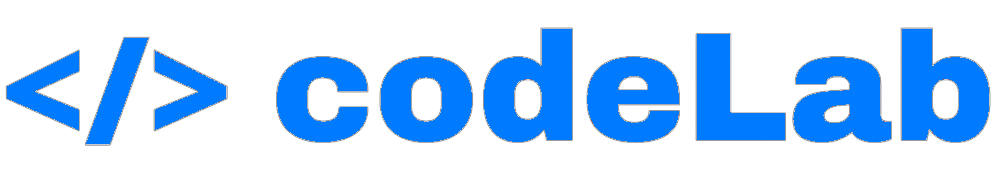

<!--
*** Thanks for checking out the Best-README-Template. If you have a suggestion
*** that would make this better, please fork the repo and create a pull request
*** or simply open an issue with the tag "enhancement".
*** Don't forget to give the project a star!
*** Thanks again! Now go create something AMAZING! :D
-->

<!-- PROJECT SHIELDS -->
<!--
*** I'm using markdown "reference style" links for readability.
*** Reference links are enclosed in brackets [ ] instead of parentheses ( ).
*** See the bottom of this document for the declaration of the reference variables
*** for contributors-url, forks-url, etc. This is an optional, concise syntax you may use.
*** https://www.markdownguide.org/basic-syntax/#reference-style-links
-->
[![Contributors][contributors-shield]][contributors-url]
[![Forks][forks-shield]][forks-url]
[![Stargazers][stars-shield]][stars-url]
[![Issues][issues-shield]][issues-url]
[![GPL-3.0 License][license-shield]][license-url]

<!-- PROJECT LOGO -->
 

  

  <h3 align="center">codeLab App</h3>

  

    An upcoming app that teaches people to code for free!
     
    <a href="https://github.com/codelabofficial/app"><strong>Explore the docs »</strong></a>
     
     
    <a href="https://codelabapp.uk">View Demo</a>
    ·
    <a href="https://codelabapp.uk">Report Bug</a>
    ·
    <a href="https://codelabapp.uk">Request Feature</a>
  

<!-- TABLE OF CONTENTS -->

  
Table of Contents

  <ol>
    <li>
      <a href="#about-the-project">About The Project</a>
      <ul>
        <li><a href="#built-with">Built With</a></li>
      </ul>
    </li>
    <li>
      <a href="#getting-started">Getting Started</a>
      <ul>
        <li><a href="#prerequisites">Prerequisites</a></li>
        <li><a href="#installation">Installation</a></li>
      </ul>
    </li>
    <li><a href="#usage">Usage</a></li>
    <li><a href="#roadmap">Roadmap</a></li>
    <li><a href="#contributing">Contributing</a></li>
    <li><a href="#license">License</a></li>
    <li><a href="#contact">Contact</a></li>
    <li><a href="#acknowledgments">Acknowledgments</a></li>
  </ol>

<!-- ABOUT THE PROJECT -->
## About The Project

There are many different app out there that claim you can learn to code without paying a thing. The reality is, 9/10 of these "free" apps requie you to pay to unlock a full course. codeLab has been built with this in mind, featuring courses for the most popular languages that are fully unlocked the moment you download the app.

Here's why you should download codeLab:
* It is COMPLETELY free, the app has no in-app purchases available
* Downloading codeLab will help support the open-source community
* It helps support us, two students who have put hundreds of hours of work into this :smile:

As you can imagine, this can't be done without any money, as there is quite a lot funds required. codeLab on the App Store does contain adverts, but we took them out for the GitHub repo. If you can, please install through the App Store - it helps us out a bunch!

Open `codeLab.xcworkspace` to get started.

(<a href="#top">back to top</a>)

### Built With

This section should list any major frameworks/libraries used to bootstrap your project. Leave any add-ons/plugins for the acknowledgements section. Here are a few examples.

* [Swift](https://swift.org/)
* [Xcode](https://developer.apple.com/xcode/)
* [Firebase](https://firebase.google.com/)

(<a href="#top">back to top</a>)

<!-- GETTING STARTED -->
## Getting Started

This is an example of how you may give instructions on setting up your project locally.
To get a local copy up and running follow these simple example steps.

### Prerequisites

You do not need to install any dependencies as of now, will need to open the `codeLab.xcworkspace` file, and not `codeLab.xcodeproj`.

### Installation

_Below is an example of how you can instruct your audience on installing and setting up your app. This template doesn't rely on any external dependencies or services._

1. Setup your Firebase app with authentication at [https://firebase.google.com](https://firebase.google.com)
2. Make sure you are using `codeLab.xcworkspace`
3. Edit the `info.plist` file and add your App ID at GADApplicationIdentifier
4. Build the project

(<a href="#top">back to top</a>)

<!-- ROADMAP -->
## Roadmap

- [x] Add Firebase login
- [x] Add relevant sections
- [x] Add "which language should I learn" quiz
- [x] Add course selection
- [ ] Add advert support
- [ ] Add sign in with Google/Apple
- [ ] Add courses
- [ ] Multi-language Support
    - [ ] Chinese
    - [ ] Spanish
    - [ ] French
    - [ ] Italian

See the [open issues](https://github.com/codelabofficial/app/issues) for a full list of proposed features (and known issues).

(<a href="#top">back to top</a>)

<!-- CONTRIBUTING -->
## Contributing

Contributions are what make the open source community such an amazing place to learn, inspire, and create. Any contributions you make are **greatly appreciated**.

If you have a suggestion that would make this better, please fork the repo and create a pull request. You can also simply open an issue with the tag "enhancement".
Don't forget to give the project a star! Thanks again!

1. Fork the Project
2. Create your Feature Branch (`git checkout -b feature/AmazingFeature`)
3. Commit your Changes (`git commit -m 'Add some AmazingFeature'`)
4. Push to the Branch (`git push origin feature/AmazingFeature`)
5. Open a Pull Request

(<a href="#top">back to top</a>)

<!-- LICENSE -->
## License

Distributed under the GNU General Public Use v3.0 License. See `LICENSE` for more information.

(<a href="#top">back to top</a>)

<!-- CONTACT -->
## Contact

Your Name - [@codeLabAppDevs](https://twitter.com/codeLabAppDevs)

Project Link: [https://github.com/codelabofficial/app](https://github.com/codelabofficial/app)

(<a href="#top">back to top</a>)

<!-- ACKNOWLEDGMENTS -->
## Acknowledgments

Use this space to list resources you find helpful and would like to give credit to. I've included a few of my favorites to kick things off!

* [Choose an Open Source License](https://choosealicense.com)
* [Img Shields](https://shields.io)
* [GitHub Pages](https://pages.github.com)
* [This README template](https://github.com/othneildrew/Best-README-Template)

(<a href="#top">back to top</a>)

<!-- MARKDOWN LINKS & IMAGES -->
<!-- https://www.markdownguide.org/basic-syntax/#reference-style-links -->
[contributors-shield]: https://img.shields.io/github/contributors/codelabofficial/app.svg?style=for-the-badge
[contributors-url]: https://github.com/codelabofficial/app/graphs/contributors
[forks-shield]: https://img.shields.io/github/forks/codelabofficial/app.svg?style=for-the-badge
[forks-url]: https://github.com/codelabofficial/app/network/members
[stars-shield]: https://img.shields.io/github/stars/codelabofficial/app.svg?style=for-the-badge
[stars-url]: https://github.com/codelabofficial/app/stargazers
[issues-shield]: https://img.shields.io/github/issues/codelabofficial/app.svg?style=for-the-badge
[issues-url]: https://github.com/codelabofficial/app/issues
[license-shield]: https://img.shields.io/github/license/codelabofficial/app.svg?style=for-the-badge
[license-url]: https://github.com/codelabofficial/app/blob/main/LICENSE
[linkedin-shield]: https://img.shields.io/badge/-LinkedIn-black.svg?style=for-the-badge&logo=linkedin&colorB=555
[linkedin-url]: https://linkedin.com/in/othneildrew
[product-screenshot]: images/screenshot.png
